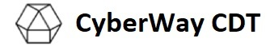

  

*****  
[](https://buildkite.com/cyberway.cdt)  
[](https://github.com/cyberway/cyberway.cdt/blob/master/LICENSE)  

# CyberWay.CDT (Contract Development Toolkit based on EOSIO.CDT)
## Version : 1.6.3


CyberWay.CDT is a toolchain for WebAssembly (WASM) and set of tools to facilitate contract writing for the CyberWay platform.  In addition to being a general purpose WebAssembly toolchain, [CyberWay](https://github.com/cyberway/cyberway) specific optimizations are available to support building CyberWay smart contracts.  This toolchain is built around [Clang 7](https://github.com/eosio/llvm), which means that CyberWay.CDT has the most currently available optimizations and analyses from LLVM, but as the WASM target is still considered experimental, some optimizations are not available or incomplete.


### Guided Installation (Building from Scratch)
```sh
$ git clone --recursive https://github.com/cyberway/cyberway.cdt
$ cd cyberway.cdt
$ ./build.sh
$ sudo ./install.sh
```

### Installed Tools
---
* eosio-cpp
* eosio-cc
* eosio-ld
* eosio-init
* eosio-abidiff
* eosio-wasm2wast
* eosio-wast2wasm
* eosio-ranlib
* eosio-ar
* eosio-objdump
* eosio-readelf

## Contributing

[Contributing Guide](./CONTRIBUTING.md)

[Code of Conduct](./CONTRIBUTING.md#conduct)

## License

[MIT](./LICENSE)

## Important

See [LICENSE](./LICENSE) for copyright and license terms.

All repositories and other materials are provided subject to the terms of this [IMPORTANT](./IMPORTANT.md) notice and you must familiarize yourself with its terms.  The notice contains important information, limitations and restrictions relating to our software, publications, trademarks, third-party resources, and forward-looking statements.  By accessing any of our repositories and other materials, you accept and agree to the terms of the notice.
